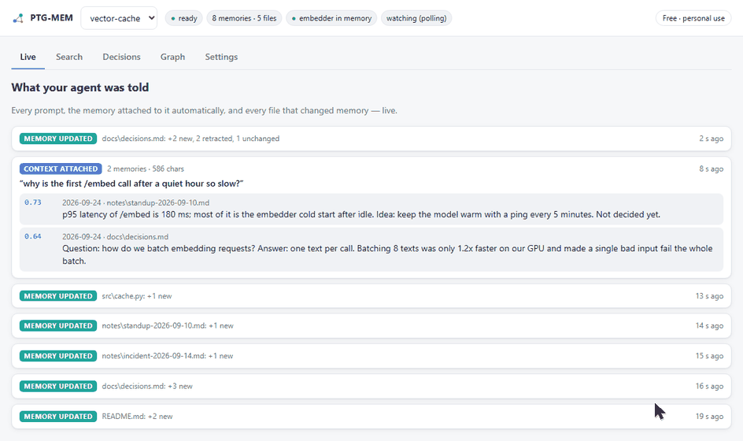

# PTG-MEM

[Русская версия](README.ru.md)

**Chaos on your disk, order in your AI's context.**

Local memory for Claude Code and Codex. It keeps a map of everything in your folder (notes, chat
exports, scripts, code nobody here wrote) and hands the model only the few pieces it needs, marking
which of them were later replaced.



*Real screenshots of the PTG-MEM window on a demo project. The decision changed in
`docs/decisions.md`, and the next prompt gets the current version. The old one is shown struck
through, so the agent knows not to use it.*

## The problem

A working folder after a few months with AI: chat exports, notes, three versions of the same plan,
half-broken scripts, a module Claude wrote last month that nobody has read since. Give all of it to
a model and it goes wrong in predictable ways.

* **It doesn't fit, or it eats your limit.** The model rereads the pile on every task.
* **Things get lost in a long list.** In my own measurements a small local model found the first of
  18 records 61 % of the time and the last one 21 %
  ([report](https://github.com/Deadatreides/LLM-MEASUREMENTS/blob/main/experiments/theory_emergent_swarm/reports/REPORT_K1.en.md)).
* **It builds on the plan you cancelled two weeks ago.** The old version and the new one look
  equally convincing, and nothing in the folder says which one won.

## What PTG-MEM does

* **Indexes in the background.** A local daemon watches the project folder and your Claude Code /
  Codex sessions. A new or edited file is searchable within seconds; you never run "index" again.
* **Attaches context to every prompt.** A hook adds the 3–5 most relevant memories, about 1k tokens
  with a hard cap. If nothing is relevant enough, nothing is attached.
* **Knows what was replaced.** Memory is a graph with typed links: `supersedes`, `contradicts`,
  `fixes`, `refines`, `revises`. When a note changes, the old version stays in history and is never
  served as current.
* **Shows its work.** A local window lists every prompt with exactly what was attached to it, plus
  search and the decision log.

## Code nobody here wrote

Legacy is the same kind of pile. Whether a colleague wrote it in 2014 or Claude wrote it yesterday,
nobody in the room has read it. PTG-MEM ships a code map (Code PTG) that turns a codebase into cards
and answers your agent's questions over MCP:

* **a card for every function and class:** parameters, outgoing calls, size, complexity, location;
* **who uses it and what it uses:** calls, imports, implements, tests, straight from static
  analysis, with no LLM calls;
* **what can break if you change it:** everything that reaches it through those links, up to N hops
  away;
* **the card's version history.**

Python, and C/C++/CUDA through tree-sitter. Today it is a separate CLI and MCP server; one-command
setup through `ptg install` comes next. Its console messages are still partly in Russian.

```bash
python -m ptg_mem.code_ptg.cli index --project path/to/code --no-embeddings
python -m ptg_mem.code_ptg.cli risks SomeClass.some_method --project path/to/code
python -m ptg_mem.code_ptg.mcp_server --project path/to/code   # MCP server for your agent
```

Cards, links and risks come from static analysis and need no model. With an embedding model
(`--model`, or the `CODE_PTG_MODEL` variable) cards are also grouped by meaning. The map is stored
in `.code_ptg/` inside the project.

## Quick start

```bash
pip install "ptg-mem[st] @ git+https://github.com/Deadatreides/PTG-MEM.git"   # not on PyPI yet
cd your-project
ptg init                         # shows how many files will be indexed, asks first
ptg install claude               # hooks + MCP for this project (or: ptg install codex)
ptg gui                          # the live window
```

No git on the machine? Install the release wheel instead:
`pip install "ptg-mem[st] @ https://github.com/Deadatreides/PTG-MEM/releases/download/v0.2.0/ptg_mem-0.2.0-py3-none-any.whl"`.

`[st]` brings a CPU/GPU embedder through sentence-transformers. `ptg init` downloads the default embedding model (Qwen3-Embedding-0.6B, ~1.2 GB) on first use. A
GGUF model through llama.cpp works too: `ptg init --gguf model.gguf` (needs
`pip install "ptg-mem[gguf] @ git+https://github.com/Deadatreides/PTG-MEM.git"`).

A Claude Code plugin is included (`/plugin marketplace add Deadatreides/PTG-MEM`, then
`/plugin install ptg-mem`). It still needs the Python package above.

## How it works

```
 your files ─┐                      ┌─ Claude Code hooks (SessionStart, UserPromptSubmit, Stop)
 sessions  ──┼─► ptg daemon ◄──────┼─ MCP server: ptg_search, ptg_node, ptg_decisions, ptg_remember
 notes     ──┘   (127.0.0.1)        └─ GUI in your browser
```

* **One daemon owns the memory.** Hooks, MCP, CLI and GUI are thin clients, so there is no fight
  over files and no long load on every agent start.
* **An atom is one exchange or one paragraph.** A changed file is compared atom by atom, so an edit
  adds only what changed. Reasoning blocks of agent sessions are never stored, and API keys are cut
  out of every text before it is embedded.
* **Search is plain vector search; the graph says what is current.** We measured that graph-first
  search does not find more (see below). So search ranks by similarity, and the graph answers a
  different question: was this replaced, contradicted or fixed, and by what.

## Measured

On a real 22 405-atom research archive (Windows 10, GTX 1660 SUPER 6 GB, Qwen3-Embedding-4B GGUF):

| | |
|---|---|
| recall latency, warm model | **0.10–0.13 s** per prompt |
| recall latency, cold (model loads) | ~3 s, first prompt only |
| load the store | 4.2 s (was 40 s in the JSON format) |
| save the store | 11 s (was ~90 s), 646 MB (was 1.7 GB) |
| new file to searchable | ~12 s without file-system events, instant with them |
| graph connectivity | mean degree 32.2, zero orphans |

## Limits we measured and keep in plain sight

* **The graph does not find more than plain vector search.** On our archive plain cosine finds
  70.3 % against 64.9 % for graph-first search; on LongMemEval V1 at k=10, 98.3 % against 91.7 %.
  That is why search is plain. The harness is in [`bench/`](bench/).
* **"A replaces B" guessed from text is noisy.** On the reference archive 68 % of such guesses link
  texts that are not true replacements, so search honours a guessed replacement only above cosine
  0.75. Your own edits are exact: that is what `revises` is for.
* **Answer accuracy is unmeasured.** Other memory systems publish model-judged answer accuracy;
  ours is recall. The two are not comparable, and we do not compare them.
* **Tested on Windows 10 by the author.** CI runs the engine tests on macOS, Linux and Windows with
  a stand-in embedder. Real-model runs on macOS and Linux are pending. Codex hooks follow the
  documented schema but have not been tried in a live Codex session yet.

If a claim in this README isn't backed by a number in this repository, it's a bug: open an issue.

## Privacy

* Nothing is indexed until you run `ptg init` in a folder.
* Weights, run dumps, `node_modules`, VCS folders and similar are skipped by default. Per-project
  excludes go in `~/.ptg-mem/projects.json`.
* Credential-looking strings (`sk-…`, `ghp_…`, `AKIA…`, JWTs, private keys, …) are replaced before
  anything is embedded or stored.
* The daemon listens on 127.0.0.1 only, and every API call needs a per-run token.

## Free and Pro

Free for personal use, forever (AGPL-3.0). Pro is a signed offline key, in the spirit of WinRAR:

* search across all your projects at once;
* export of the decision log to Markdown;
* memory packs: share a project's memory with a teammate, read-only (in progress);
* no nagging. After day 40 you get a polite weekly reminder, and you can ignore it forever.

Companies that cannot use AGPL: see [COMMERCIAL.md](COMMERCIAL.md).

## Where this came from

I'm a design engineer, not a programmer. Six months of experiments with local models left thousands
of chat logs, notes and scripts on my disk, and the agent kept building on decisions I had already
reversed. PTG-MEM started as a fix for my own mess. The measurements behind it are in
[LLM-MEASUREMENTS](https://github.com/Deadatreides/LLM-MEASUREMENTS).

## Status and support

Early (0.2). Each release announces the next one. Issues are read, but there is no support
obligation.
